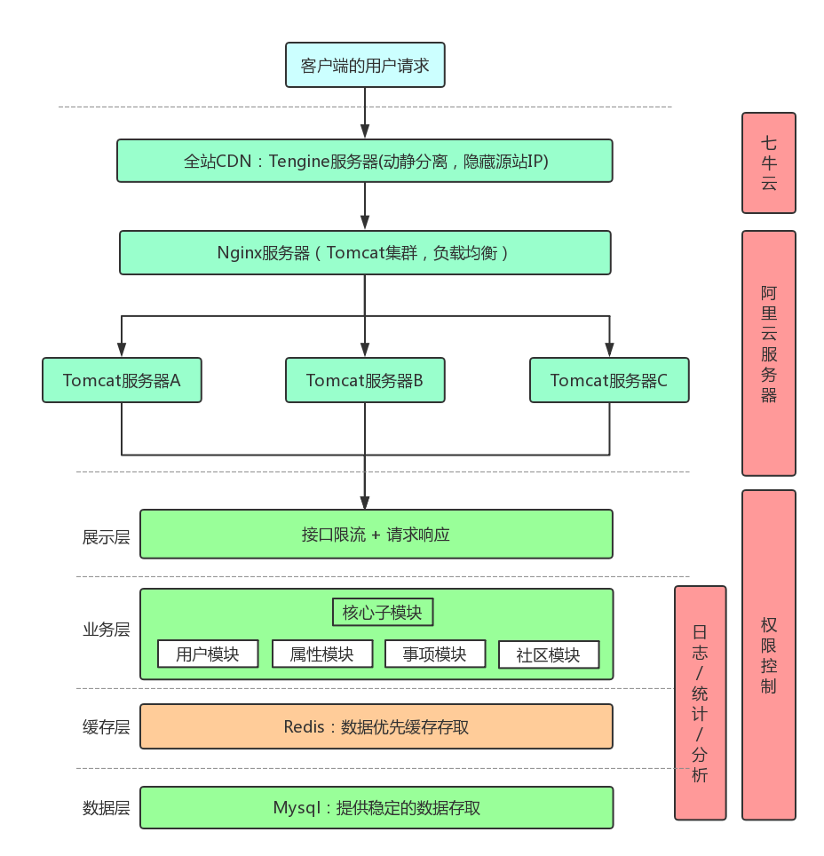

# 人升 LifeUp（server）

  

《人升》是一款旨在实现「人生游戏化」的待办事项手机应用。

在待办事项的基础上，我们加入了人生数值化的属性体系、等级体系、组队体系等，并且打算以这种方式激励用户的使用激情。

## 下载地址

https://www.coolapk.com/apk/net.sarasarasa.lifeup

## 现有功能

- 待办事项的增加、完成、修改、放弃
- 待办事项的通知提醒
- 待办事项的期限设置，逾期情况的处理
- 待办事项的奖励制度，用户的数值体现
- 查看统计，用户的属性数值
- 查询历史待办事项
- 多种渠道的登陆（手机号、QQ、易班）

## 技术点

+ SpringBoot 2.0
+ Mybatis-Plus
+ Redis
+ OAuth 2.0
+ Swagger
+ Guava
+ Lombok
+ ...

## 后台架构

